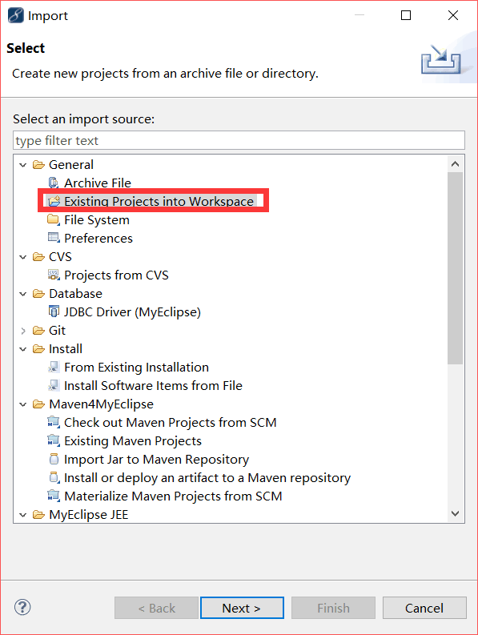

#NiceFish-SpringMybatis

这是NiceFish的Java版后台。

纯前端的NiceFish在这里：http://git.oschina.net/mumu-osc/NiceFish

#用法

这是一个MyEclipse2014工程，最简单的SpringMVC+MyBatis，所有依赖的jar包都提交上来了，不依赖任何其它内容。

- 克隆本项目的代码

- 用MyEclipse2014或更高版本import项目，就像这样：

- 在你本地的mysql里面执行docs/nicefish.sql建好库

- 修改src/config.properties里面的数据库连接路径和用户名密码

- 重新编译项目，然后发布到你自己的Tomcat里面去

- 打开你的浏览器，访问你的项目路径

# 说明

这个项目的目的是示范最新版本的Angular如何与基于SpringMVC的后台服务进行对接。我会逐步把功能丰富起来，目前我一个人在做，加上要出去讲课、要写文章啥的，进度会慢一些。

如果你有兴趣一起来玩儿，请联系我。