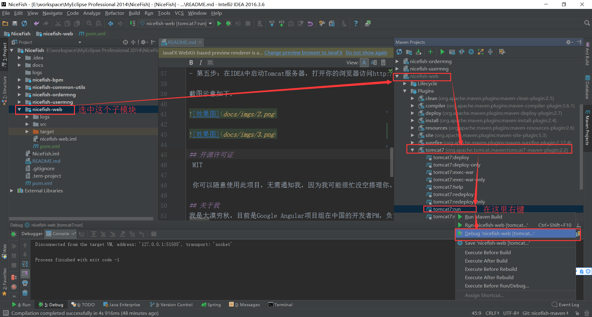

# NiceFish-SpringMybatis

NiceFish是一个系列项目，都是Angular这个技术栈。

- 【NiceFish（美人鱼）】：这是一个微型Blog系统，前端基于Angular 4.0.0 + ng-Bootstrap。http://git.oschina.net/mumu-osc/NiceFish/

- 【NiceFish-Admin是系统管理界面，基于Angular 4.0.0】：http://git.oschina.net/mumu-osc/NiceFish-Admin

- 【NiceFish-Admin-ng1是一个基于Angular 1.6.4（最新版）的管理后台模板，刚开始做】https://git.oschina.net/mumu-osc/NiceFish-Admin-ng1.git 。这个项目我需要特别说明一下，根据目前的统计数据，还有我在数十家企业实际看到的情况，国内还有大量的企业在使用Angular 1.x，而其中很多居然没有做任何AMD处理！我的天哪！前端开发发展到了今天这个状态，AMD是标配啊兄弟们。就算你还在用jQuery做项目，AMD也是必须的哦。把所有js全部压在一个大文件里面，然后在index里面一次性加载，不能再这样做了啊！所以我会很快做好这个项目，给你们一个示范，看看大型的业务项目应该如何切分目录、模块，如何做AMD加载。

- 【NiceFish-ionic】：这是一个移动端的demo，基于ionic。http://git.oschina.net/mumu-osc/nicefish-ionic

- 【NiceFish-SpringMybatis是Java版后台】：http://git.oschina.net/mumu-osc/NiceFish-SpringMybatis 

NiceFish可以用来搭建个人Blog、微型SNS站点，或者用于学习Angular（其实我并不在乎你用来干嘛，那关我什么事呢对吧？）。 

一起来玩儿吧！很好玩儿哦！

# 使用方法

前后端是完全分离开发的，此项目对应的前端代码位于NiceFish项目的nicefish分支上。请注意，是在http://git.oschina.net/mumu-osc/NiceFish/ 这个项目的nicefish分支上，与其它分支无关，其它分支都是我们日常开发过程中建的分支，还有2个是教学用的分支，与此项目无关。

此项目采用的是maven的组织方式，开发工具使用的是IDEA。

- 第一步：克隆此项目的代码。
- 第二步：在IDEA中导入此项目并配置好Tomcat，如果你不知道如何操作，请点击这个链接，里面有详细的步骤http://www.thinksaas.cn/topics/0/685/685545.html 。
- 第三步：建库，sql脚本在docs/sqls目录下，推荐使用最新版本的mysql或者MariaDB。
- 第四步：配置并启动nginx，把nginx的静态资源目录指向纯前端项目NiceFish的dist目录，如果您不知道如何配置，请点击这个链接https://my.oschina.net/zhongzhong5/blog/894186 关于NiceFish纯前端项目的构建过程，请查看项目对应的README。再次强调，能与后端服务对接的代码位于NiceFish项目的nicefish分支上！
- 第五步：在IDEA中启动Tomcat服务器，打开你的浏览器访问http://127.0.0.1，就可以看到界面了。

截图示意如下：

## 开源许可证
 MIT

 你可以随意使用此项目，无需通知我，因为我可能很忙没空搭理你。

## 关于我
我是大漠穷秋，目前是Google Angular项目组在中国的开发者PM，负责Angular的推广工作，我会在各种渠道经常发布一些与Angular相关的技术文章，希望能给大家带来一点点帮助，请点这里：https://my.oschina.net/mumu/blog  。

如果您的企业或者组织需要Angular方面的技术支持，请填写这份申请单：https://gdgdocs.org/forms/d/e/1FAIpQLSfKA15nS0md58fR__tAV6gSEIPsVsLksT9knOgObq9IbVPuQg/viewform

【注意】我每天都会收到大量的求助消息，真的有点忙，所以请准确描述您的问题，最好能加上一些截图，非常感谢！

## 在线交流QQ群

<a target="_blank" href="//shang.qq.com/wpa/qunwpa?idkey=8db5ed802cbddbf6432d7ba7dc4f2a316be020442491eb41cbfb1a12434e8cc7" class="list-group-item"><i class="fa fa-qq" aria-hidden="true"></i> Angular 1区:286047042（满）</a>

<a target="_blank" href="//shang.qq.com/wpa/qunwpa?idkey=cbfcd79e7e90939b0e2c519f475fac4792985ce2abc5ad45ec5e06ffcfe944dd" class="list-group-item"><i class="fa fa-qq" aria-hidden="true"></i> Angular 2区:139357161（满）</a>

<a target="_blank" href="//shang.qq.com/wpa/qunwpa?idkey=639229c8b6ad0c3a9a8f381dddf5d7785780b20d8c37eb25c91ac73ea7d37a5f" class="list-group-item"><i class="fa fa-qq" aria-hidden="true"></i> Angular 3区:473129930（满）</a>

<a target="_blank" href="//shang.qq.com/wpa/qunwpa?idkey=12add102af3f67910bdc0de753dee10ebada08ab485af7e38f4dfa0ee27476f7" class="list-group-item"><i class="fa fa-qq" aria-hidden="true"></i> Angular 4区:483016484（将满）</a>
